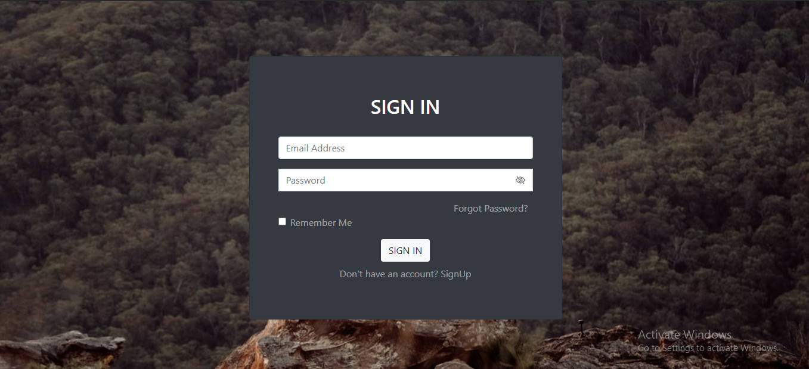
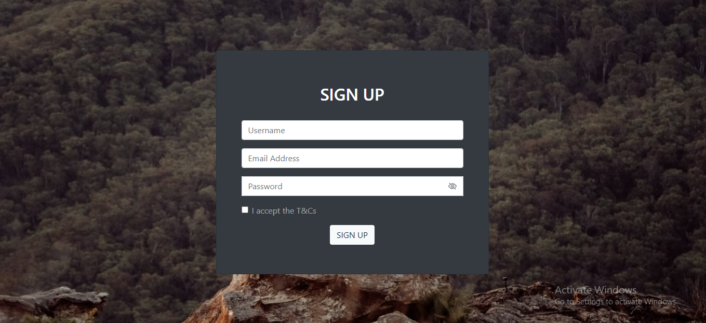
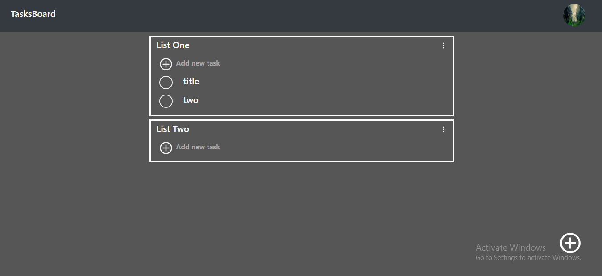
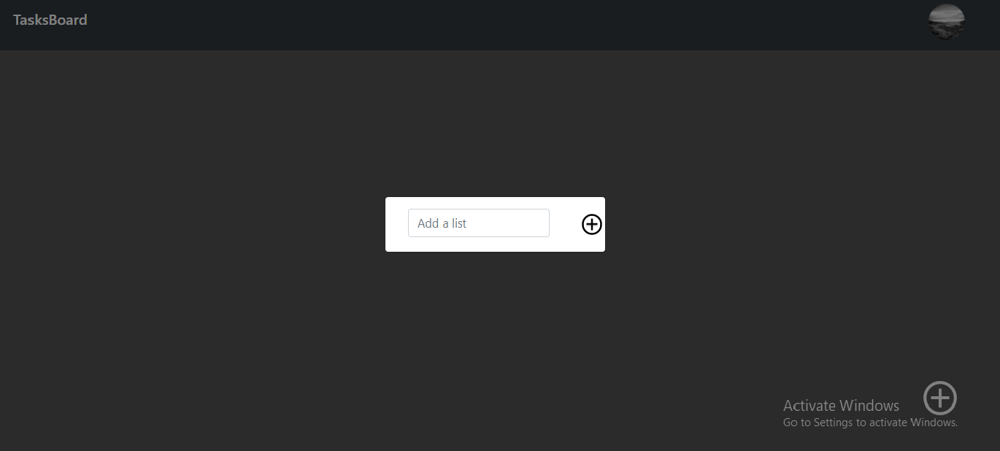

# TASKBOARD

    * There are four pages:
        * Home page (/)
        * SignIn Page (/signin)
        * SignUp Page (/signup)
        * PageNotFound (\*)
    * All pages are responsive and in dark-mode.

## Sign Up

    * U need to enter Email Address, Username & Password.
    * Users data is stored in localstorage with the key 'users'..

## Sign In

    * U need to enter Email Address & Password.
    * If user has not signed up, toast a message "Sign Up first".
    * Else if password is incorrect, toast a message "Incorrect Password".
    * Else if user has found in localstorage & password has matched, redirect to Home Page.

## Home Page

    * Profile pic at top-right is getting generated randomly.
    * Add a list on clicking the (+) button at bottom-right.
    * In a list, you can add multiple tasks.
    * FOr a task, you can add title,, detail & date.

# URL LINK

    * [Click here](https://taskboard-fari.netlify.app/)

# Screenshots

